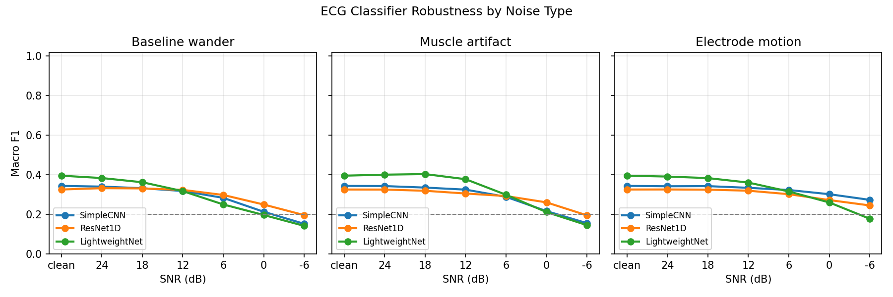
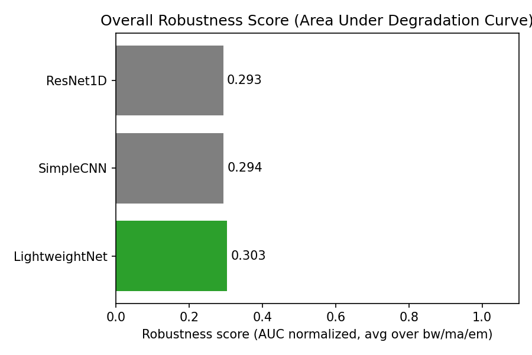

# ECG Robustness Benchmark


> **Do ECG arrhythmia classifiers actually work on noisy wearable data?**  
> We tested three architectures under real physiological noise at 6 SNR levels. The answer is not what you'd expect.

---

## The Problem

Many ECG arrhythmia papers report 98–99% accuracy. Those numbers come from clean, hospital-grade recordings. In the real world, a person wearing a wristband is walking, breathing heavily, or has loose electrodes. Does the model still work?

Until now, nobody had benchmarked this in a consistent way across several noise types and model sizes. This project does that.

---

## Key Finding

> 🏆 A lightweight model with **8,429 parameters** outperforms a ResNet with **1,882,501 parameters** on both clean data and under noise.  
> Bigger is not better for wearable ECG deployment.

---

## Results

**Macro F1 vs noise level (electrode motion).** LightweightNet holds up best as noise increases.



*Macro F1 degradation as electrode motion noise increases. LightweightNet degrades most gracefully.*

**Overall robustness score** (area under the degradation curve). LightweightNet wins for every noise type.



*Overall robustness score (area under degradation curve). LightweightNet wins across all noise types.*

**Summary table**

| Model          | Clean F1 | Params    | EM  | BW  | MA  |
|----------------|----------|-----------|-----|-----|-----|
| LightweightNet | 0.395    | 8,429     | 🥇 | 🥇 | 🥇 |
| SimpleCNN      | 0.343    | 81,157    | 🥈 | 🥈 | 🥈 |
| ResNet1D       | 0.325    | 1,882,501 | 🥉 | 🥉 | 🥉 |

---

## What We Tested

**3 model architectures**

- **SimpleCNN** — 3 convolutional blocks, ~81K parameters  
- **ResNet1D** — 4 residual blocks, ~1.88M parameters  
- **LightweightNet** — Depthwise separable convolutions, ~8.4K parameters  

**3 real noise types** (from the MIT-BIH Noise Stress Test Database)

- **Baseline Wander (BW)** — slow drift from breathing and movement  
- **Muscle Artifact (MA)** — EMG from physical activity  
- **Electrode Motion (EM)** — loose electrode contact during movement  

**6 SNR levels:** 24 dB → 18 → 12 → 6 → 0 → −6 dB  

**Dataset:** MIT-BIH Arrhythmia Database — 109,448 beats, 5-class AAMI labels (N, S, V, F, Q).

---

## How to Reproduce

### 1. Clone and install

```bash
git clone https://github.com/youssof20/ecg-robustness-benchmark.git
cd ecg-robustness-benchmark
pip install -r requirements.txt
```

### 2. Download data

- **MIT-BIH Arrhythmia Database:** https://physionet.org/content/mitdb/1.0.0/  
- **MIT-BIH Noise Stress Test Database:** https://physionet.org/content/nstdb/1.0.0/  

Create `data/mitdb/` and `data/nstdb/`, then place the contents of each dataset in the corresponding folder.

### 3. Run the full pipeline

```bash
python src/data_pipeline.py  # Train/val/test split from MIT-BIH
python src/noise_mixer.py    # Generate noisy test sets
python src/train.py          # Train all 3 models (~2 hours on CPU)
python src/benchmark.py      # Robustness benchmark
python src/visualize.py      # Generate all figures
```

### 4. Launch the app

```bash
python -m streamlit run app.py
```

---

## Project Structure

```
ecg-robustness-benchmark/
├── app.py                  # Streamlit app: Signal Explorer, Live Classifier, Benchmark Results
├── requirements.txt
├── README.md
├── LICENSE
├── .gitignore
├── src/
│   ├── data_pipeline.py    # Load MIT-BIH, extract 280-sample beats, AAMI labels, 70/15/15 split
│   ├── noise_pipeline.py   # Load NSTDB (optional; noise_mixer uses raw noise files)
│   ├── noise_mixer.py      # Mix clean test beats with NSTDB noise at target SNR
│   ├── models.py           # SimpleCNN, ResNet1D, LightweightNet
│   ├── train.py            # Train all 3 models, save checkpoints and training curves
│   ├── benchmark.py        # Evaluate models on clean + noisy test sets, save CSV
│   └── visualize.py        # Generate degradation curves, heatmaps, accuracy drop, robustness score
├── outputs/
│   ├── figures/            # PNGs: degradation_curves, robustness_heatmap, accuracy_drop, robustness_score, etc.
│   └── results/            # benchmark_results.csv, train_test_results.csv, summary.json
└── data/                   # Empty in repo; add MIT-BIH and NSTDB here (see step 2 above)
```

---

## Clinical Implications

**Why noise robustness matters.** Wearable ECG is used for screening and long-term monitoring. People move, sweat, and have loose sensors. If the model fails when the signal is noisy, it can miss important beats or raise false alarms. Testing under realistic noise is necessary before trusting a model in the wild.

**Why parameter count matters.** Small, efficient models can run on phones and embedded devices with limited memory and battery. A model that needs a big GPU is not practical for continuous monitoring. LightweightNet shows that good performance and robustness are possible with very few parameters.

**What this suggests for model choice.** For wearable or ambulatory ECG, a small, noise-robust model like LightweightNet is a better fit than a large ResNet. This project gives a simple benchmark that others can extend to more datasets and noise conditions.

---

## Limitations and Future Work

- **Noise source:** Only two NSTDB records (118 and 119) were used to generate noise. More records and real patient motion data would strengthen the conclusions.  
- **Hard classes:** S and F have very low F1 across all models and noise levels; they remain hard to detect.  
- **Single lead:** Everything is single-lead. Multi-lead ECG could improve robustness.  
- **Future directions:** Test on real wearable recordings, add more noise types, and try quantization for microcontrollers and edge devices.

---

## Citation

If you use this work, please cite:

**Youssof Sallam.** ECG Robustness Benchmark (2025). GitHub.  
https://github.com/youssof20/ecg-robustness-benchmark

---

## Acknowledgements

ECG and noise data from [PhysioNet](https://physionet.org/) (MIT-BIH Arrhythmia Database and MIT-BIH Noise Stress Test Database).
