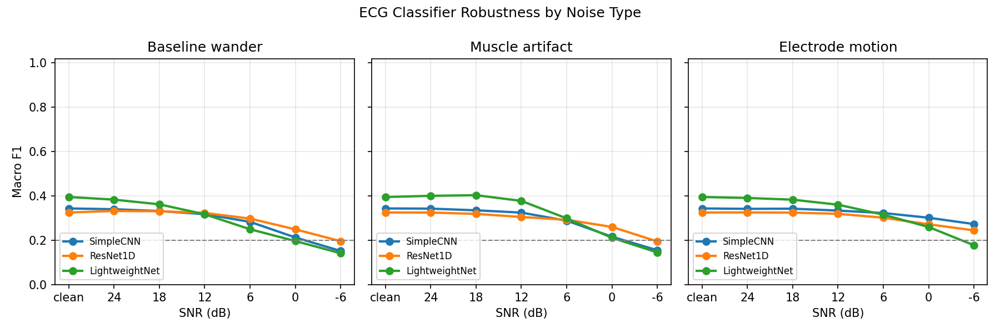

# ecg-robustness-benchmark

Tests ECG beat classifiers under common signal noise.

Three model architectures are evaluated under baseline wander, muscle artifact, and electrode-motion noise at six SNR levels.

## Data

* MIT-BIH Arrhythmia Database
* MIT-BIH Noise Stress Test Database

Five AAMI beat classes are used.

## Models

* SimpleCNN — ~81K parameters
* ResNet1D — ~1.88M parameters
* LightweightNet — ~8.4K parameters

## Results

| Model          | Clean macro F1 | Parameters |
| -------------- | -------------: | ---------: |
| LightweightNet |          0.395 |      8,429 |
| SimpleCNN      |          0.343 |     81,157 |
| ResNet1D       |          0.325 |  1,882,501 |

LightweightNet also had the highest robustness score across the three tested noise types.



## Run

```bash
pip install -r requirements.txt

python src/data_pipeline.py
python src/noise_mixer.py
python src/train.py
python src/benchmark.py
python src/visualize.py
```

Optional app:

```bash
python -m streamlit run app.py
```

## Limits

Only two Noise Stress Test Database records were used as noise sources.

The benchmark is single-lead.

Performance on the S and F classes remains low.

## License

MIT
